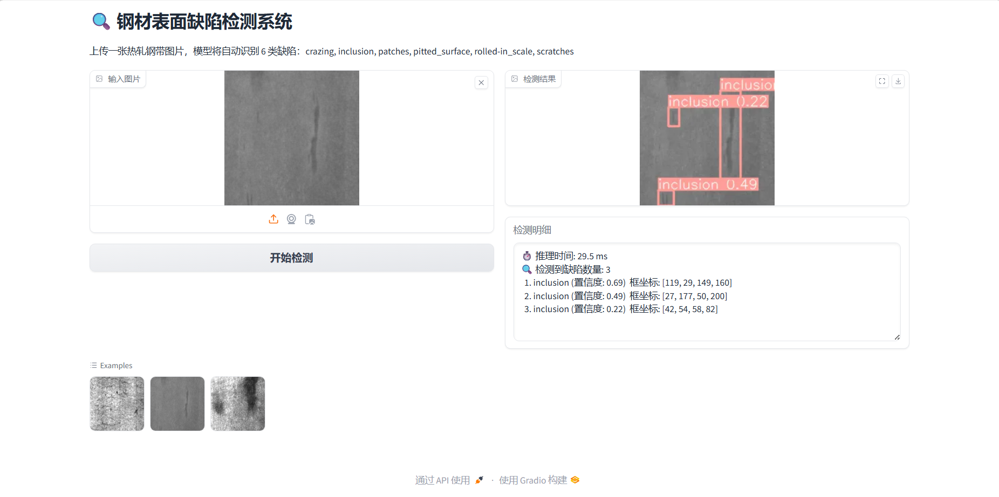
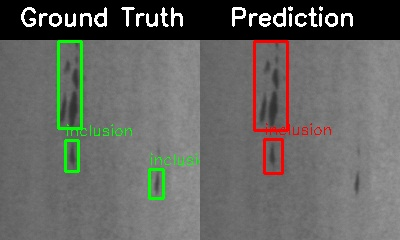

# 🔍 NEU-DET 钢材表面缺陷检测 (基于 YOLOv8)

使用 **YOLOv8** 对东北大学 NEU-DET 数据集进行钢材表面缺陷检测，支持训练、超参数调优、推理、结果对比可视化、Gradio 交互演示以及 ONNX 部署。

## 📁 项目结构

```
NEU-DET_YOLO/
├── data/                       # 数据集
│   ├── voc_developtool/        # VOC 格式开发工具（备用）
│   └── yolo_format/            # YOLO 格式
│       ├── images/
│       ├── labels/
│       └── data.yaml
├── demo/                       # 推理输出样例
│   ├── comparison/             # 真实标注 vs 预测的对比图
│   └── test_predict/           # 测试集预测结果
├── deploy/                     # 部署模型
│   └── best.onnx
├── runs/                       # 训练/调优输出（自动生成）
│   ├── detect/                 # 训练结果
│   └── tune/                   # 调优结果
├── scripts/                    # 工具脚本
│   ├── app.py                  # Gradio Web 演示
│   ├── onnx_export.py          # ONNX 导出与测速
│   └── visualize_comparison.py # 生成真值/预测对比图
├── inference.py                # 批量推理脚本
├── train.py                    # 训练脚本
├── tune.py                     # 超参数搜索脚本
├── yolo8n.pt                   # 初始权重（可选，训练时会自动下载）
└── requirements.txt
```

## ✨ 特性

- **模块化命令行**：训练、调优、推理均支持多种命令行参数，可直接覆盖默认配置。
- **超参数调优**：使用 YOLO 接口 `model.tune()` 进行超参数调优——支持遗传进化算法和 Ray Tune 方法。
- **结果对比可视化**：并排展示 Ground Truth 与预测框，直观评估模型。
- **交互式 Web 演示**：基于 Gradio 拖拽上传图片即可实时检测。
- **ONNX 部署**：导出 ONNX 格式并对比 PyTorch / ONNX Runtime 推理速度。

## 🛠️ 环境要求

- Python 3.8+
- PyTorch 1.10+ (推荐 CUDA 支持)
- 其他依赖可通过以下命令安装：

```bash
pip install ultralytics gradio onnxruntime opencv-python-headless numpy pyyaml
```

## 📦 数据集准备

本项目使用 NEU-DET 数据集，包含 6 类钢材表面缺陷：

| 类别 ID | 英文名称        | 中文名称   | 说明                               |
|---------|-----------------|------------|------------------------------------|
| 0       | crazing         | 裂纹       | 表面网状或龟甲状细小裂纹           |
| 1       | inclusion       | 夹杂       | 非金属夹杂物在表面形成的缺陷       |
| 2       | patches         | 斑块       | 形状不规则的氧化皮或锈蚀斑块       |
| 3       | pitted_surface  | 麻点/点蚀  | 细小密集的凹坑，呈点状分布         |
| 4       | rolled-in_scale | 轧入氧化皮 | 轧制过程中氧化皮被压入表面         |
| 5       | scratches       | 划痕       | 机械划伤形成的线状痕迹             |

- **原始发布地址**：[NEU-DET数据集作者](http://faculty.neu.edu.cn/songkechen/zh_CN/zhym/263269/list/index.htm) （东北大学 Song Kechen 课题组）
- **备选下载**：方便起见，也可从 [gitcode副本](https://gitcode.com/open-source-toolkit/fa031) 下载，请自行校验文件完整性。

下载后解压，按以下结构整理为 YOLO 格式：

```
data/yolo_format/
├── images/
│   ├── train/   # 训练图片
│   └── test/    # 测试图片
├── labels/
│   ├── train/   # 训练标签 (.txt)
│   └── test/    # 测试标签
└── data.yaml    # 数据集配置文件
```

数据集配置文件`data.yaml` 示例（使用时根据实际路径调整）：

```yaml
path: project_root/data/yolo_format  # 指向数据集所在文件夹
train: images/train
val: images/test
test: images/test

nc: 6
names: ['crazing', 'inclusion', 'patches', 'pitted_surface', 'rolled-in_scale', 'scratches']
```

## 🚀 快速开始

### 1. 训练设置

使用默认参数训练 YOLOv8：

```bash
python train.py
```

常用自定义参数示例（更多参数可在脚本内直接修改）：

```bash
# 训练 100 轮，初始学习率 0.0005
python train.py --epochs 200 --lr0 0.0005

# 使用更大的模型 YOLOv8s，输入尺寸 640
python train.py --model yolo8s.pt --imgsz 640 --batch 8

# 使用调优得到的最佳超参数
python train.py --hyp runs/tune/best_hyperparameters.yaml
```

采用YOLO默认输出格式，结果保存在 `runs/detect/train` 目录下，包含权重、日志、混淆矩阵等图表。

### 2. 超参数调优

```bash
# 使用遗传算法搜索 50 次试验
python tune.py --iterations 50

# 使用 Ray Tune 并行搜索（需安装 ray）
python tune.py --use_ray --iterations 100

# 自定义搜索空间（YAML 文件）
python tune.py --hyp custom_search_space.yaml --iterations 80
```

调优结束后，最佳超参数会保存在 `runs/detect/tune/best_hyperparameters.yaml`，可在训练时通过 `--hyp` 加载。

### 3. 推理

对测试集进行批量预测并保存可视化结果：

```bash
python inference.py
```

默认使用的模型权重是通过以下流程得到的最佳模型：
1. 先使用默认参数训练一次得到基线结果；
2. 运行超参数调优（遗传算法 50 次试验）搜索最优超参数；
3. 使用搜索到的最佳超参数文件重新训练，得到最终模型，保存目录为 `runs/detect/train52/`。
因此脚本中 `model_path` 指向 `runs/detect/train52/weights/best.pt`。
如果自己进行训练，请将脚本中的 `model_path` 修改为你最终训练输出的路径。

### 4. 结果对比可视化

生成 Ground Truth 和模型预测的并排对比图：

```bash
python scripts/visualize_comparison.py
```

输出保存在 `demo/comparison/`，便于直观评估检测框质量。

### 5. Web 演示 (Gradio)

启动本地 Gradio 交互界面：

```bash
python scripts/app.py
```

浏览器访问 `http://127.0.0.1:7860`，上传图片即可实时查看检测结果和置信度。



如需公网分享，可修改 `app.py` 中 `demo.launch(share=True)`，并确保相应端口未被防火墙拦截。

### 6. ONNX 导出与性能测试

训练完成后，可将 PyTorch 模型导出为轻量级的 ONNX 格式，方便在不依赖 PyTorch 的环境下部署，并获得显著的推理加速。

```bash
python scripts/onnx_export.py
```

脚本完成以下操作：

- 从 `runs/detect/train52/weights/best.pt` 导出 ONNX 模型至 `deploy/best.onnx`
- 在 CPU 上分别运行 500 次推理并计算平均耗时，对比性能

在本项目的测试环境（CPU）下，性能对比如下（对于320*320像素image）：

| 推理框架      | 平均耗时 (ms) | 加速比 |
|---------------|----------------|--------|
| PyTorch       | 24.11          | 1.0x   |
| ONNX Runtime  | 6.83           | 约 3.5x |

转换为 ONNX 后推理速度提升约 3.5 倍，适合实际部署场景。


## 📊 模型性能

YOLOv8 默认根据验证集 **mAP@0.5:0.95** 最高来保存 `best.pt`。  
训练最后 10 个 epoch （可设置）会自动关闭 Mosaic 增强，此时模型通常会达到最佳性能。

下表对比了两个模型在各自保存的 `best.pt` 对应的 epoch 上的表现。

| 模型                      | mAP@0.5 | mAP@0.5:0.95 | Precision | Recall | F1    | 最佳 Epoch |
|---------------------------|---------|---------------|-----------|--------|-------|-------------|
| YOLOv8n (baseline)        | 0.734   | 0.464         | 0.620     | 0.723  | 0.668 | 94           |
| YOLOv8n (tunning)    | 0.787   | 0.453         | 0.740     | 0.754  | 0.747 | 44           |

> 超参数调整后模型在 mAP@0.5 和 F1 分数上有提升，综合来看检测能力更强，即在精确率和召回率的平衡上表现更优。

完整的训练日志、损失曲线、混淆矩阵等信息保存在 `runs/detect/train` 和 `runs/detect/train52` 目录下。

## ⚙️ 可配置参数速查

`train.py` 支持命令行调整训练参数，参数名称与含义同YOLO接口`model.train()`一致，完整列表可在 `train.py` 查看。关键参数组：

| 参数组   | 常用参数                                                                               |
|----------|----------------------------------------------------------------------------------------|
| 基础     | `--model`, `--data`, `--epochs`, `--batch`, `--imgsz`, `--device`, `--resume`          |
| 优化器   | `--optimizer`, `--lr0`, `--lrf`, `--momentum`, `--weight_decay`                        |
| 损失权重 | `--box`, `--cls`, `--dfl`, `--label_smoothing`                                         |
| 数据增强 | `--mosaic`, `--mixup`, `--hsv_h/s/v`, `--degrees`, `--scale`, `--erasing`              |
| 模型     | `--freeze`, `--dropout`                                                                |
| 其他     | `--cache`, `--fraction`, `--patience`, `--seed`                                        |

## 📈 结果示例

下图同时展示了真实标注（左）与模型预测（右）的对比效果，绿色框为 Ground Truth，红色框为模型输出。

<div align="center">
  
</div>

> 更多对比结果请查看 `demo/comparison/` 目录。

## 📚 引用

如果你使用了本项目或 NEU-DET 数据集，请引用相应来源：

- NEU-DET 数据集论文：*Song K, Yan Y. A noise robust method based on completed local binary patterns for hot-rolled steel strip surface defects[J]. Applied Surface Science, 2013.*
- YOLOv8: Ultralytics YOLO, [https://github.com/ultralytics/ultralytics](https://github.com/ultralytics/ultralytics)

推荐阅读：[YOLOv8 PyTorch 实现](https://deepwiki.com/bubbliiiing/yolov8-pytorch) —— 由 bubbliiiing 开源的高质量复现，文档详尽，适合用来深入理解模型细节。